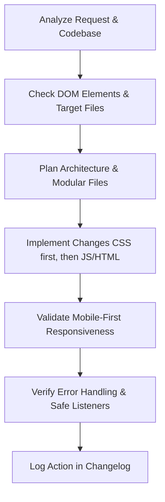

# Sherif-Auto Workspace Memory & Guidelines

This document serves as the persistent memory, architectural blueprint, and mistake-prevention guidelines for **Sherif-Auto** development. All agents working on this project must adhere strictly to these rules to ensure design cohesion, performance, and code quality.

---

## 1. Project Niche & Aesthetics
* **Brand Identity:** Premium Auto Upholstery, Custom Seats, and Dashboard Restoration.
* **Vibe:** Luxury, Craftsmanship, Impeccable Detail.
* **Colors (Light Theme Default Variables - Split Theme Layout):**
  * Primary Light Background: `#FFFFFF`
  * Surface Background: `#F8F9FA`
  * Text Colors: Dark Charcoal (`#2C2C2C`) or off-black.
  * Accent/Highlight Gold: `#D4AF37`
  * Secondary Gold/Muted: `#8B6914`
  * Split Theme Dark Hero background: Strictly solid `#121212` (high-contrast white/gold texts)
* **Typography:**
  * Headings: `Montserrat` (Bold, modern)
  * Luxury Accents: `Playfair Display` (Elegant serif)
* **Visual Effects:** 
  * Semi-transparent glassmorphism (`backdrop-filter: blur()`).
  * Smooth, premium transitions and micro-animations.

---

## 2. Technical Stack & Constraints
* **Structure:** Semantic HTML5 only (Zero framework template engines).
* **Styling:** Modular CSS3 files linked to individual components.
* **Logic:** Native ES6+ JavaScript (Native ES Modules where possible, strict scoping, event delegation).
* **Animation:** Native CSS animations combined with GreenSock (GSAP) for timelines.
* **Backend:** Firebase integration.
* **No Frameworks:** No React, Vue, Svelte, Next.js, or Tailwind CSS unless explicitly requested and approved.

---

## 3. Core Development Workflow (Step-by-Step)
For every modification or feature request, follow this exact workflow:

1. **Context & Dependency Check:** Check if matching elements exist on the current page before running animations or logic.
2. **Modular File Isolation:** Write new styles in target files (e.g., `CSS/upholstery.css`, `CSS/cart-drawer.css`) instead of bundling everything in `style.css`.
3. **Safeguard JS Selectors:** Always use `if (!element) return;` or event delegation to prevent JS errors from blocking page lifecycle events.
4. **Mobile First:** Ensure layout, typography (`clamp()`), and touch targets (minimum `44x44px`) are optimized for mobile before scaling to desktop.
5. **Verify Performance:** Strictly animate CSS `transform` and `opacity` properties to avoid layout thrashing.
6. **Log Progress:** Update the project changelog at the bottom of this file after any modification.

---

## 4. Critical Mistake Prevention Checklist
- [ ] **Dynamic Elements Guard:** Do not let scripts crash when elements (like search bar, cart, or wishlist drawers) are missing on subpages (e.g., `privacy-policy.html` or `gallery.html`).
- [ ] **CSS Pollution:** Avoid generic CSS classes like `.container`, `.card`, or `.btn` without local nesting or BEM namespaces to prevent style bleeding.
- [ ] **Image Paths:** Ensure all image resources use exact relative paths (e.g., `images/CAR Models/...` or `images/gallery/...`).
- [ ] **Production Cleanliness:** Do not commit `console.log()` statements, draft scripts, or inline CSS styles (`style="..."` on HTML markup).
- [ ] **Event Listeners:** Clean up/remove event listeners if elements are dynamically re-rendered.
- [ ] **Theme Switching Cleanup:** The site runs strictly on Light Mode by default, with a dark hero section (#121212) on the homepage. Do not re-introduce theme switcher controls, switches, or local storage theme reading/writing logic unless requested.

---

## 5. Project Changelog
This section tracks every update, refactor, and modification made to the project.

| Date | Type of Change | Modified Files | Description |
| :--- | :--- | :--- | :--- |
| 2026-07-06 | Initialization | `.agents/AGENTS.md` | Created the workspace memory and guidelines document. |
| 2026-07-06 | Fix & Refactor | `CSS/style.css`, `CSS/navbar.css`, `CSS/vehicle-card.css`, `privacy-policy.html`, `terms-of-service.html` | Fixed light mode contrast and visual issues; resolved broken JS imports and CSS links on legal pages. |
| 2026-07-06 | Refactor | `Index.html`, `category.html`, `gallery.html`, `image-preview.html`, `privacy-policy.html`, `terms-of-service.html`, `CSS/style.css`, `JS/script.js`, `JS/footer.js` | Enforced strictly dark theme by default, merged theme variables into root, and removed all light mode switching toggles/logic. |
| 2026-07-06 | Refactor | `Index.html`, `category.html`, `gallery.html`, `image-preview.html`, `privacy-policy.html`, `terms-of-service.html`, `CSS/style.css`, `JS/script.js`, `JS/footer.js` | Enforced strictly light theme by default, merged theme variables into root, and removed all theme-switching toggles/logic. |
| 2026-07-06 | Refactor | `CSS/style.css` | Styled homepage hero section background dark charcoal and adjusted typography/buttons for premium readability. |
| 2026-07-06 | Fix | `JS/footer.js` | Replaced Lucide icons in the footer with Font Awesome classes to resolve missing/unrendered icons. |
| 2026-07-06 | Refactor | `CSS/style.css` | Updated homepage hero section background to strictly solid #121212 and removed overlay gold/gradients. |
| 2026-07-06 | Fix | `JS/script.js` | Implemented requestAnimationFrame-based counter animations to animate stat-number values when scrolled into view. |
| 2026-07-06 | Feature | about.html, CSS/about.css, JS/footer.js, Index.html, category.html, gallery.html, privacy-policy.html, terms-of-service.html | Created professional About Us page (about.html) with custom timeline and interactive stitch/leather visualizer. Updated navigation links globally. |
| 2026-07-06 | Refactor | about.html, CSS/about.css | Improved values section with 6 cards, custom interactive/animated SVG icons, and a restored grey backdrop. |
| 2026-07-06 | Feature | about.html, CSS/about.css, JS/scroll-stack.js | Integrated Vanilla port of React Bits ScrollStack 3D scroll stacking cards for the process timeline section. |
| 2026-07-12 | Dependency | package.json | Installed Lenis via npm dependency. |
| 2026-07-12 | Refactor | images/gallery/craftsman_stitching.jpg | Replaced the Our Legacy section image with a high-end photo of a handsome craftsman sewing a car seat cloth. |
| 2026-07-12 | Refactor | CSS/about.css | Removed all micro-animations, tilts, and keyframe loops from the Our Values section for a clean, stable layout. |
| 2026-07-12 | Refactor | about.html | Replaced values card SVGs with customized variations of the official car seat brand logo. |
| 2026-07-12 | Refactor | about.html, CSS/about.css | Integrated Tailwind visualizer layout, styled controls to match light-default theme variables, and limited colors list to Black, White, and Blue. |
| 2026-07-12 | Fix | about.html | Resolved visualizer DOM lifecycle race conditions with document.readyState checks and bypassed browser dark-mode swatch inversions using CSS linear-gradients. |
| 2026-07-12 | Refactor | about.html | Removed thread color selection features entirely from visualizer, and defaulted active stitch color to brand gold. |
| 2026-07-12 | Refactor | about.html | Re-integrated thread color selectors with White, Black, and Blue options, styled with darkreader-ignore parameters to bypass dark mode inversions. |
| 2026-07-14 | Fix | CSS/about.css, about.html | Integrated swatches and header layout with the global website theme: restored section tag styling, title typography (Playfair Display), description sizes, and aligned margins. |
| 2026-07-14 | Documentation | `design.md` | Created the comprehensive design specification document detailing typography, colors, layout rules, and components. |
| 2026-07-14 | Fix | CSS/about.css, about.html | Unified the entire about.html page with the subpage light theme specification: refactored the Hero and CTA sections to light backgrounds with dark text, and removed inline dark styles. |
| 2026-07-14 | Fix | CSS/about.css | Synced the visualizer info badge gold colors (translucency, border, text) with the global metallic gold theme variable. |
| 2026-07-14 | Fix | CSS/about.css | Refactored the Stitch & Thread Visualizer section and control card to a premium dark theme layout, preventing disjointed white backgrounds. |
| 2026-07-14 | Fix | about.html, CSS/about.css | Created `.scroll-stack-card-inner` child wrapper to bypass Chromium 3D transform forced dark-mode transparent background sorting bug, resolving text doubling/overlaps. |
| 2026-07-14 | Fix | CSS/about.css | Synced the visualizer description text box background (`rgba(28, 31, 38, 0.9)`) with the site's dark theme slate color. |
| 2026-07-14 | Fix | JS/scroll-stack.js | Added window `load` listener to recalculate card coordinates after all story images load, resolving timeline section scroll/pin mismatch. |
